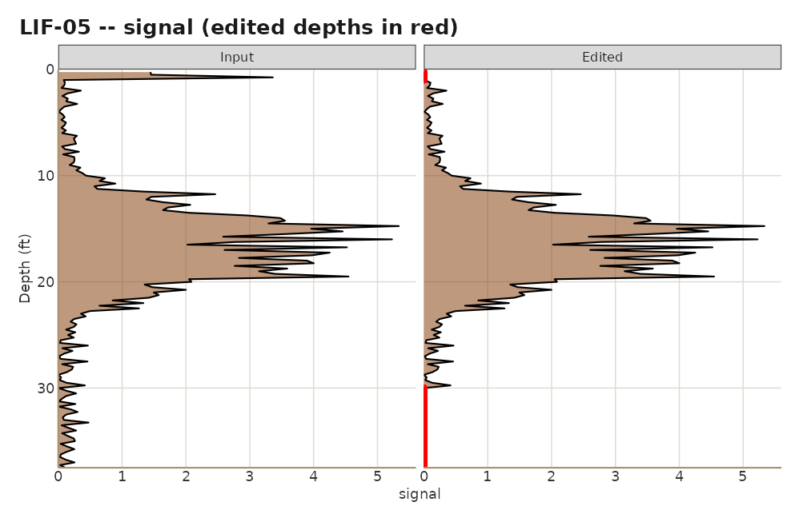

# Editing logs with an audit trail

``` r

library(lifr)
demo <- system.file("extdata", "demo", package = "lifr")
lif <- lif_import(demo, verbose = FALSE)
```

## Why edit at all

LIF logs pick up things that are not product: smear in the top foot
where the probe was still settling, a spike at a rod change, a
fluorescent mineral seam, a stretch below total depth where the probe
was already pulling back. Left in, those readings inflate peak
statistics and put false hot spots on the map. Taken out silently, they
leave a reviewer wondering what was removed and why.

`lifr` editors do the second part properly. Every edit sets `signal` to
a replacement value (0 by default) over a depth window and appends a row
to an edit history that travels with the data frame and prints in the
site report.

## The editor family

| Function | Zeroes | Scope |
|----|----|----|
| [`lif_editor()`](https://mjorden.github.io/lifr/reference/lif_editor.md) | inside a depth window | one boring |
| [`lif_editor_bulk()`](https://mjorden.github.io/lifr/reference/lif_editor_bulk.md) | inside a depth window | every boring |
| [`lif_keep()`](https://mjorden.github.io/lifr/reference/lif_keep.md) | **outside** a depth window | one boring |
| [`lif_zero_shallow()`](https://mjorden.github.io/lifr/reference/lif_zero_shallow.md) | at or above a depth | every boring or a subset |
| [`lif_zero_below_threshold()`](https://mjorden.github.io/lifr/reference/lif_zero_below_threshold.md) | wherever signal is below a value | every boring or a subset |
| [`lif_apply_edits()`](https://mjorden.github.io/lifr/reference/lif_apply_edits.md) | whatever a plan table says | rows of the plan |

### Delete a window

``` r

lif <- lif_editor(lif, "LIF-03", top = 20, bottom = 22)
#> [lif_editor] LIF-03: zeroed 9 row(s) (20-22 ft)
```

Several windows in one call:

``` r

lif <- lif_editor(lif, "LIF-05", delete = list(c(0, 1.5), c(30, Inf)))
#> [lif_editor] LIF-05: zeroed 37 row(s) (0-1.5 ft, 30-Inf ft)
```

### Preview first

`preview = TRUE` reports how many readings would change and returns the
data unchanged:

``` r

lif_editor(lif, "LIF-07", top = 0, bottom = 3, preview = TRUE)
#> [lif_editor] PREVIEW LIF-07: zeroed 12 row(s) (0-3 ft)
#> <edited_data> 3 edit(s) recorded -- provenance attached (edit_history() to inspect).
#> <lif_data> 12 boring(s), 1489 sample(s), depth 0.2-37.5 ft, 3 edit(s)
#>   channels: signal, ec, hp, color
#>    easting northing depth signal boring   msl    ec   hp   color
#> 1   1014.5   2017.9  0.25  2.506 LIF-01 149.6  8.87 2.79 #6B8E23
#> 2   1014.5   2017.9  0.50  0.206 LIF-01 149.6  9.31 2.41 #B0B0B0
#> 3   1014.5   2017.9  0.75  2.146 LIF-01 149.6  9.75 2.59 #6B8E23
#> 4   1014.5   2017.9  1.00  0.095 LIF-01 149.6  9.40 2.83 #B0B0B0
#> 5   1014.5   2017.9  1.25  0.208 LIF-01 149.6 10.38 2.97 #B0B0B0
#> 6   1014.5   2017.9  1.50  0.098 LIF-01 149.6  9.38 2.68 #B0B0B0
#> 7   1014.5   2017.9  1.75  0.213 LIF-01 149.6 10.07 2.72 #B0B0B0
#> 8   1014.5   2017.9  2.00  0.148 LIF-01 149.6  9.48 3.08 #B0B0B0
#> 9   1014.5   2017.9  2.25  0.050 LIF-01 149.6 10.04 2.86 #B0B0B0
#> 10  1014.5   2017.9  2.50  0.003 LIF-01 149.6  9.46 3.01 #B0B0B0
#> # ... 1479 more row(s)
```

### Keep a window instead

When the honest description is “the clean interval is 6 to 28 ft”, say
that directly rather than as two deletes:

``` r

lif <- lif_keep(lif, "LIF-02", top = 6, bottom = 28)
#> [lif_keep] LIF-02: zeroed 55 row(s) outside 6-28 ft
```

The audit row records the kept span and the zeroed rows are its
complement. The report’s log plots read that note and shade the zeroed
depths, not the kept ones.

### Whole-site helpers

``` r

lif <- lif_zero_shallow(lif, depth = 1)
#> [lif_zero_shallow] zeroed 48 row(s) above 1 ft across 12 boring(s)
lif <- lif_zero_below_threshold(lif, threshold = 0.5, borings = c("LIF-01", "LIF-04"))
#> [lif_zero_below_threshold] zeroed 246 row(s) below 0.5 across 2 boring(s)
```

## Edit plans in a CSV

For a real site, keep the edits in a file next to the data. One row per
edit:

    boring,action,top,bottom
    *,delete,0,1
    LIF-03,delete,20,22
    LIF-02,keep,6,28
    LIF-05,delete,30,

- `boring`: a boring name, or `*` for every boring (delete rows only).
- `action`: `delete` (default), `clean` (an alias), or `keep`.
- `top`, `bottom`: blank means the function’s own default, so `30,`
  reads “from 30 ft to the bottom of the boring”.

Validate the plan before applying it. Every row is checked first, so a
typo in row 5 cannot half-apply rows 1 to 4:

``` r

plan <- data.frame(boring = c("*", "LIF-03", "LIF-02", "LIF-05"),
                   action = c("delete", "delete", "keep", "delete"),
                   top    = c(0, 20, 6, 30),
                   bottom = c(1, 22, 28, NA))
fresh <- lif_import(demo, verbose = FALSE)
lif_apply_edits(fresh, plan, validate = TRUE)
#> [lif_apply_edits] Validation summary (no changes applied):
#>  boring action top bottom n_rows_affected
#>       * delete   0      1              48
#>  LIF-03 delete  20     22               9
#>  LIF-02   keep   6     28              55
#>  LIF-05 delete  30     NA              31
fresh <- lif_apply_edits(fresh, plan)
#> [lif_apply_edits] Applied 4 edit(s).
```

A `*` row that would span every reading at the site is refused; wiping
the whole dataset is never a one-liner.

## The audit trail

``` r

edit_history(fresh)
#>                   timestamp              fn boring top bottom value
#> 1 2026-09-04 20:42:47 +0000 lif_editor_bulk   <NA>   0      1     0
#> 2 2026-09-04 20:42:47 +0000      lif_editor LIF-03  20     22     0
#> 3 2026-09-04 20:42:47 +0000        lif_keep LIF-02   6     28     0
#> 4 2026-09-04 20:42:47 +0000      lif_editor LIF-05  30   1000     0
#>   n_rows_changed                                           notes
#> 1             48                                            <NA>
#> 2              9                                            <NA>
#> 3             55 kept 6-28 ft; zeroed rows outside these windows
#> 4             31                                            <NA>
```

Each row carries a time-zone-stamped timestamp, the function, the boring
(`NA` means every boring), the window, the replacement value, how many
rows changed, and any notes. Save it beside the data for the project
record:

``` r

edit_history_save(fresh, "C:/Projects/MySite/edit_log.csv")
```

Edited frames print a provenance banner so nobody mistakes them for raw
data:

``` r

print(fresh, n = 2)
#> <edited_data> 4 edit(s) recorded -- provenance attached (edit_history() to inspect).
#> <lif_data> 12 boring(s), 1489 sample(s), depth 0.2-37.5 ft, 4 edit(s)
#>   channels: signal, ec, hp, color
#>   easting northing depth signal boring   msl   ec   hp   color
#> 1  1014.5   2017.9  0.25      0 LIF-01 149.6 8.87 2.79 #6B8E23
#> 2  1014.5   2017.9  0.50      0 LIF-01 149.6 9.31 2.41 #B0B0B0
#> # ... 1487 more row(s)
```

### Carrying the history through dplyr

dplyr verbs ([`filter()`](https://rdrr.io/r/stats/filter.html),
`mutate()`, `select()`) rebuild the data frame and drop non-standard
attributes, so a pipe step silently discards the history. Save it before
and restore it after:

``` r

saved <- lif_get_edits(fresh)
sub   <- dplyr::filter(fresh, boring %in% c("LIF-02", "LIF-03"))
sub   <- lif_set_edits(sub, saved)
```

Base subsetting with `[` keeps the attribute, so
`fresh[fresh$boring == "LIF-02", ]` needs no rescue.

## Corrections are edits too

[`hp_correction()`](https://mjorden.github.io/lifr/reference/hp_correction.md)
removes the hydrostatic component of hydraulic push pressure,
[`lif_downsample()`](https://mjorden.github.io/lifr/reference/lif_downsample.md)
thins the depth spacing, and both record themselves in the same history
so the report can list them:

``` r

fresh <- hp_correction(fresh, water_table = 6)
thin  <- lif_downsample(fresh, target_interval = 1, preserve_above = 5)
#> lif_downsample: 1489 -> 596 rows (40% retained, target_interval=1 ft)
tail(edit_history(thin), 2)
#>                   timestamp             fn boring top bottom value
#> 5 2026-09-04 20:42:47 +0000  hp_correction   <NA>  NA     NA    NA
#> 6 2026-09-04 20:42:47 +0000 lif_downsample   <NA>  NA     NA    NA
#>   n_rows_changed                                                     notes
#> 5           1489                             gradient=0.433; water_table=6
#> 6            893 target_interval=1; preserve_above=5; n_in=1489; n_out=596
```

## Seeing what changed

[`qc_compare()`](https://mjorden.github.io/lifr/reference/qc_compare.md)
draws input beside edited for every boring that differs, with the
changed depths in red, and skips the rest:

``` r

plots <- qc_compare(lif_import(demo, verbose = FALSE), fresh)
#> qc_compare: 12 boring(s) with changes plotted, 0 unchanged.
names(plots)
#>  [1] "LIF-01" "LIF-02" "LIF-03" "LIF-04" "LIF-05" "LIF-06" "LIF-07" "LIF-08"
#>  [9] "LIF-09" "LIF-10" "LIF-11" "LIF-12"
plots[["LIF-05"]]
```



The site report does the same for every boring on its Boring logs tab,
with the zeroed windows shaded.
