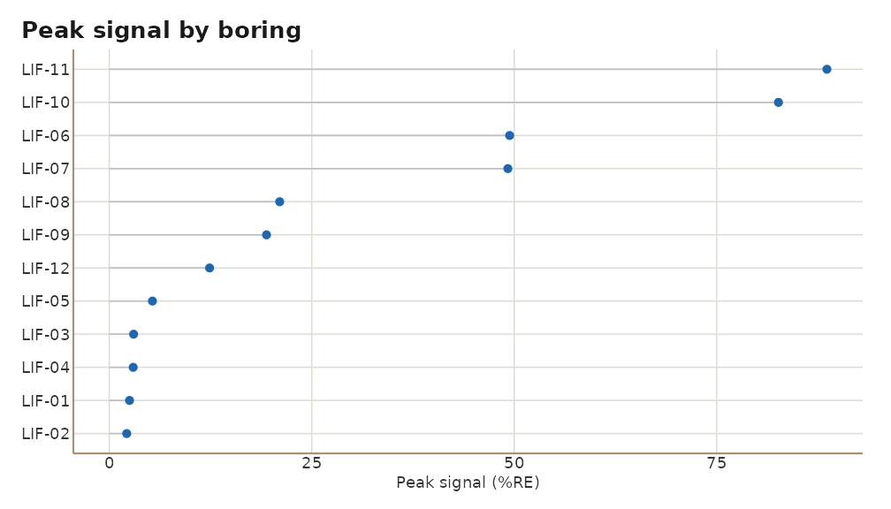
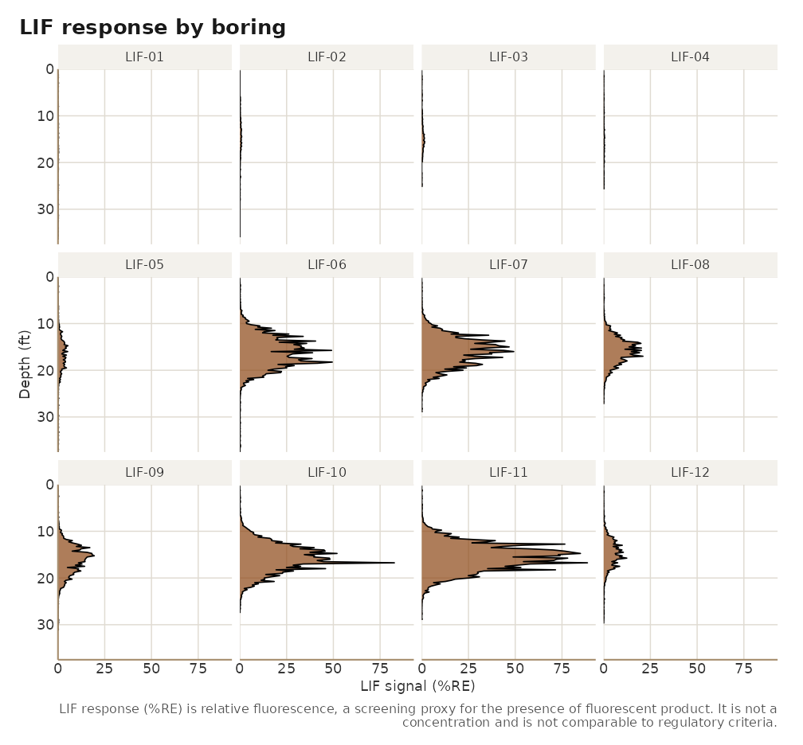
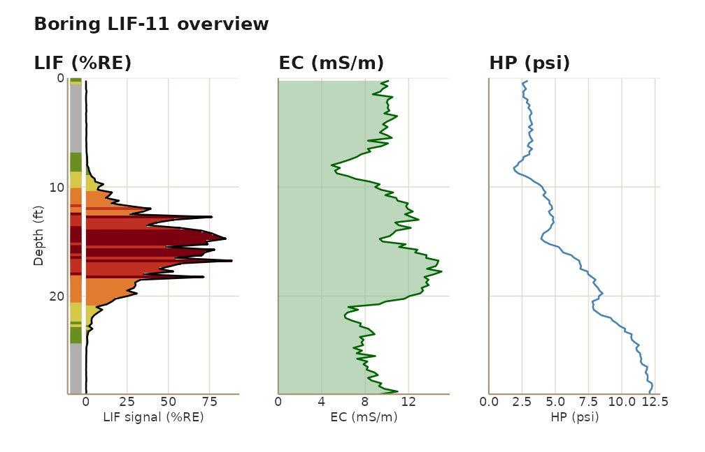
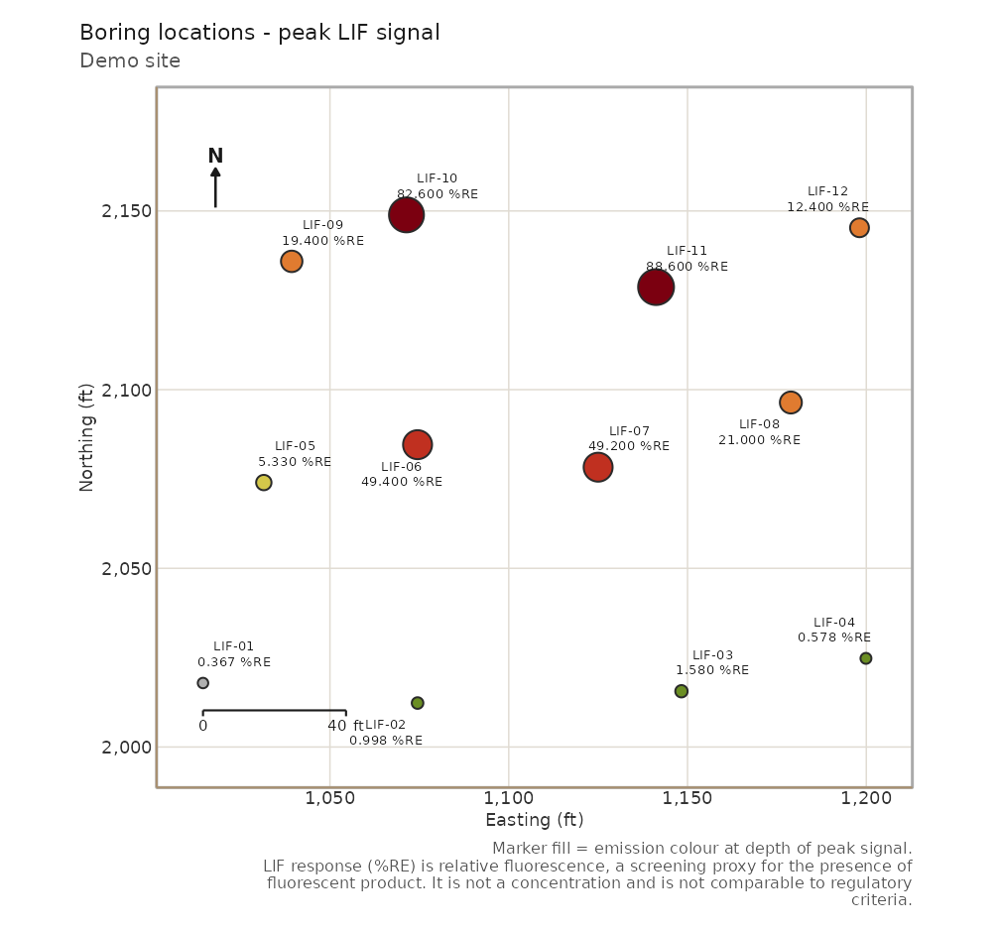

# Getting started with lifr

## What LIF data looks like

A Laser-Induced Fluorescence (LIF) probe is pushed into the ground on a
direct-push rig. A laser excites the soil through a sapphire window and
the probe records the fluorescence response every fraction of a foot.
Petroleum products and other fluorescent non-aqueous phase liquids light
up; clean soil mostly does not. The result for each boring is a log:
depth against response, usually with a few companion channels such as
electrical conductivity, hydraulic push pressure, and an emission colour
that hints at the product type.

A survey delivers one log file per boring plus a table of boring
coordinates. `lifr` turns that folder into a data frame, helps you clean
it, and renders plots and a report.

``` r

library(lifr)
```

## 1. Import

Point
[`lif_import()`](https://mjorden.github.io/lifr/reference/lif_import.md)
at the survey folder. It reads every `.lif.dat.txt`, finds the
`locations.csv`, joins the coordinates, and returns one data frame with
a row per depth reading.

``` r

demo <- system.file("extdata", "demo", package = "lifr")
lif <- lif_import(demo)
lif
#> <lif_data> 12 boring(s), 1489 sample(s), depth 0.2-37.5 ft, 0 edit(s)
#>   channels: signal, ec, hp, color
#>    easting northing depth signal boring   msl    ec   hp   color
#> 1   1014.5   2017.9  0.25  2.506 LIF-01 149.6  8.87 2.79 #6B8E23
#> 2   1014.5   2017.9  0.50  0.206 LIF-01 149.6  9.31 2.41 #B0B0B0
#> 3   1014.5   2017.9  0.75  2.146 LIF-01 149.6  9.75 2.59 #6B8E23
#> 4   1014.5   2017.9  1.00  0.095 LIF-01 149.6  9.40 2.83 #B0B0B0
#> 5   1014.5   2017.9  1.25  0.208 LIF-01 149.6 10.38 2.97 #B0B0B0
#> 6   1014.5   2017.9  1.50  0.098 LIF-01 149.6  9.38 2.68 #B0B0B0
#> 7   1014.5   2017.9  1.75  0.213 LIF-01 149.6 10.07 2.72 #B0B0B0
#> 8   1014.5   2017.9  2.00  0.148 LIF-01 149.6  9.48 3.08 #B0B0B0
#> 9   1014.5   2017.9  2.25  0.050 LIF-01 149.6 10.04 2.86 #B0B0B0
#> 10  1014.5   2017.9  2.50  0.003 LIF-01 149.6  9.46 3.01 #B0B0B0
#> # ... 1479 more row(s)
```

Every column the instrument recorded is kept. The ones `lifr`
understands are renamed to a fixed set:

| Column | Meaning | Units |
|----|----|----|
| `boring` | Boring name, from the file name |  |
| `depth` | Depth below ground surface | ft |
| `signal` | LIF response | %RE |
| `easting`, `northing` | Coordinates from the locations file | ft (projected) |
| `msl` | Ground-surface elevation from the locations file | ft |
| `ec` | Electrical conductivity, when logged | mS/m |
| `hp` | Hydraulic push pressure, when logged | psi |
| `color` | Emission-wavelength hex colour, when logged |  |

Anything else keeps a cleaned snake_case version of its header. See
[`vignette("data-format")`](https://mjorden.github.io/lifr/articles/data-format.md)
for the file formats, legacy layouts, and what happens when a boring is
missing from the locations file.

## 2. Summarise

[`summarize_lif()`](https://mjorden.github.io/lifr/reference/summarize_lif.md)
returns the standard QA tables.

``` r

qa <- summarize_lif(lif)
qa$overview
#>   n_borings n_samples   min     mean geom_mean geom_mean_n_excluded median
#> 1        12      1489 0.001 4.796974 0.5000454                    0  0.265
#>      max pct_detect
#> 1 88.607        100
head(qa$by_boring)
#>   boring   n   peak peak_depth      mean geom_mean geom_mean_n_excluded    p50
#> 1 LIF-11 116 88.607      16.75 17.428155 2.1299962                    0 2.5760
#> 2 LIF-10 110 82.625      16.75 11.949918 2.0692561                    0 2.2865
#> 3 LIF-06 150 49.434      18.25  7.987127 0.9368046                    0 0.3905
#> 4 LIF-07 116 49.217      16.00 10.106966 1.6164595                    0 1.8255
#> 5 LIF-08 109 21.045      17.00  4.157615 0.8652894                    0 0.8120
#> 6 LIF-09 125 19.417      15.25  3.646552 0.7762908                    0 0.5120
#>        p95
#> 1 74.57925
#> 2 45.34470
#> 3 34.20915
#> 4 39.87375
#> 5 17.72540
#> 6 14.93840
qa$by_threshold
#>   threshold units n_samples_above pct_samples_above n_borings_above
#> 1         1   %RE             475         31.900604              12
#> 2         2   %RE             396         26.595030              12
#> 3         5   %RE             288         19.341840               8
#> 4        10   %RE             204         13.700470               7
#> 5        50   %RE              20          1.343183               2
#>   pct_borings_above
#> 1         100.00000
#> 2         100.00000
#> 3          66.66667
#> 4          58.33333
#> 5          16.66667
```

A quick way to see which borings dominate the site:

``` r

chart_peak_by_boring(lif)
```



## 3. Clean up

Most sites need a little masking before the numbers mean anything: the
top foot or so is surface smear, and a rod change or a fluorescent
mineral seam can leave a spike that is not product. The editor family
zeroes those depth intervals and records every call.

``` r

lif <- lif_zero_shallow(lif, depth = 1)                   # all borings
lif <- lif_editor(lif, "LIF-03", top = 20, bottom = 22)   # one interval
lif <- lif_keep(lif, "LIF-02", top = 6, bottom = 28)      # keep one clean window
tail(edit_history(lif), 3)
#>                    timestamp         fn boring top bottom value n_rows_changed
#> 12 2026-09-04 20:42:51 +0000 lif_editor LIF-12   0      1     0              4
#> 13 2026-09-04 20:42:51 +0000 lif_editor LIF-03  20     22     0              9
#> 14 2026-09-04 20:42:51 +0000   lif_keep LIF-02   6     28     0             55
#>                                              notes
#> 12                                            <NA>
#> 13                                            <NA>
#> 14 kept 6-28 ft; zeroed rows outside these windows
```

Compare before and after:

``` r

raw <- lif_import(demo, verbose = FALSE)
plots <- qc_compare(raw, lif)
plots[["LIF-02"]]
```


The edit history travels with the data frame and is printed in the site
report.
[`vignette("editing")`](https://mjorden.github.io/lifr/articles/editing.md)
covers edit plans in a CSV, the keep-versus-delete choice, and how to
carry the history through a dplyr pipeline.

## 4. Plot

``` r

lif_plot(lif, "LIF-11")
```


``` r

lif_plot_all(lif, ncol = 4)
```



``` r

lif_overview(lif, "LIF-11")
```



``` r

boring_map(lif, use_instrument_color = TRUE, site_name = "Demo site")
```



[`vignette("plotting")`](https://mjorden.github.io/lifr/articles/plotting.md)
is a gallery of every plot and its options, including depth-slice maps,
the site charts, and aerial-imagery basemaps.

## 5. Report

[`process_site()`](https://mjorden.github.io/lifr/reference/process_site.md)
runs the whole pipeline in one call: import, an optional edit plan,
corrections, summary, charts, and the report.

``` r

out <- tempfile("site")
site <- process_site(demo, output_dir = out, site_name = "Demo site",
                     corrections = list(zero_shallow = 1),
                     report_formats = c("html", "md"), quiet = TRUE)
site
#> <lif_site> Demo site
#>   12 boring(s), 1489 sample(s), 12 edit(s), 4 chart(s)
#>   report(s): /tmp/RtmpPOBKQA/site1ff417418362/demo_site_report.html, /tmp/RtmpPOBKQA/site1ff417418362/demo_site_report.md
basename(unlist(site$reports))
#> [1] "demo_site_report.html" "demo_site_report.md"
```

The HTML report is one self-contained file with four tabs: Summary, Data
& QA, Processing history, and Boring logs.
[`vignette("reporting")`](https://mjorden.github.io/lifr/articles/reporting.md)
walks through each tab and the other output files.

## 6. Your own data

``` r

lif  <- lif_import("C:/Projects/MySite/LIF")
lif  <- lif_apply_edits(lif, "C:/Projects/MySite/edits.csv")
site <- process_site("C:/Projects/MySite/LIF",
                     edits      = "C:/Projects/MySite/edits.csv",
                     output_dir = "C:/Projects/MySite/out",
                     site_name  = "My Site",
                     crs        = 3452)   # State Plane EPSG code, for imagery
```

No field data yet?
[`lif_simulate()`](https://mjorden.github.io/lifr/reference/lif_simulate.md)
writes a plausible synthetic site:

``` r

lif_simulate(n_borings = 8, dir = "C:/Projects/Practice/LIF")
```

## A note on %RE

LIF response is relative fluorescence, expressed as a percentage of a
reference emitter. It tells you where fluorescent product is likely
present and how strongly it fluoresces there. It is not a concentration
and is not comparable to regulatory criteria; `lifr` never maps it onto
such criteria, and every chart and report carries that disclosure.
