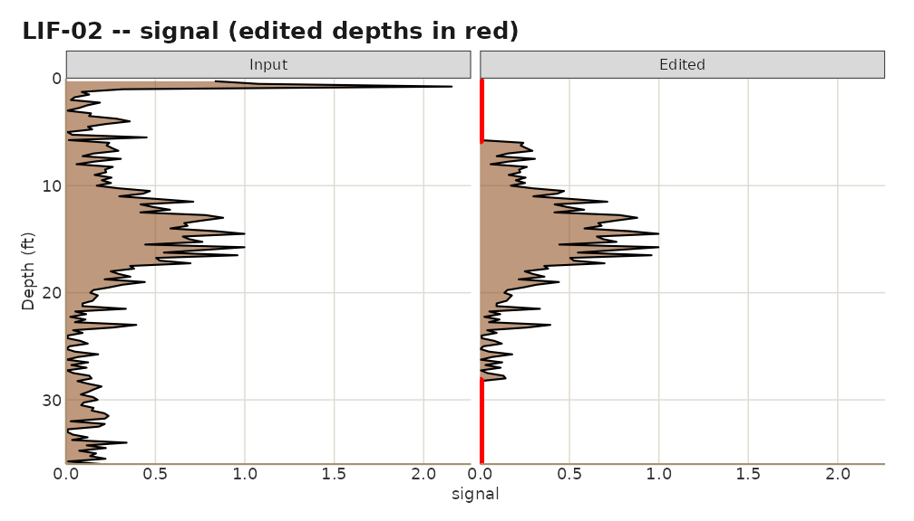
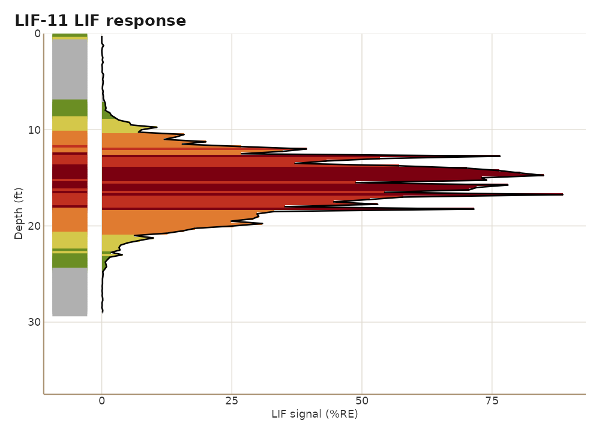
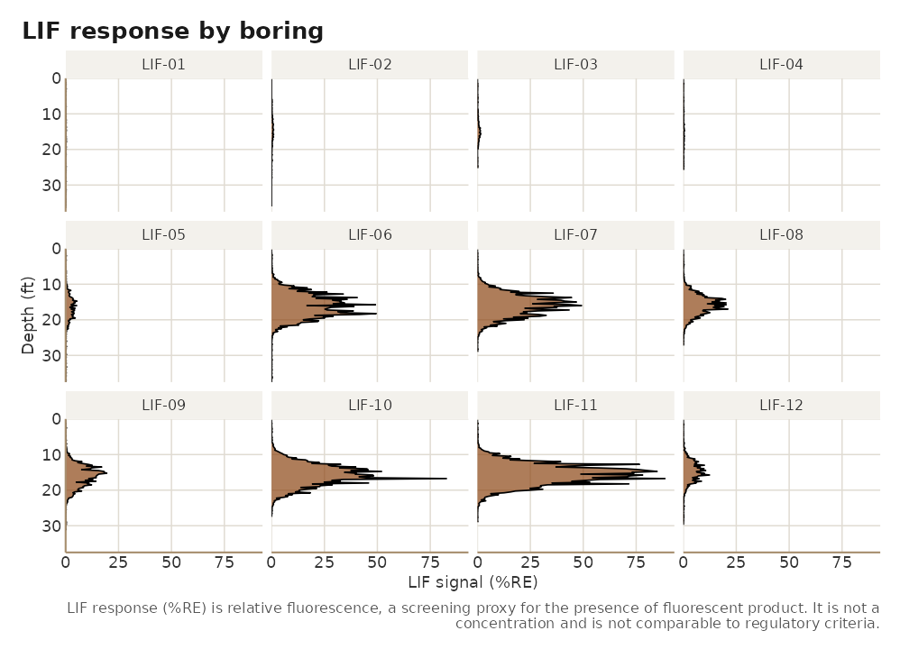
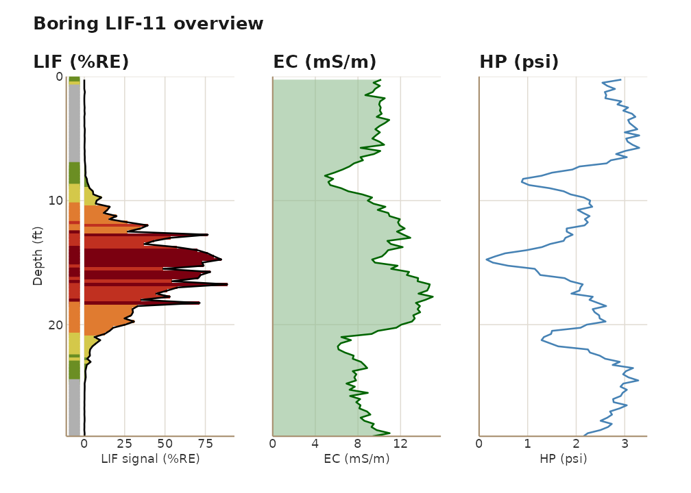
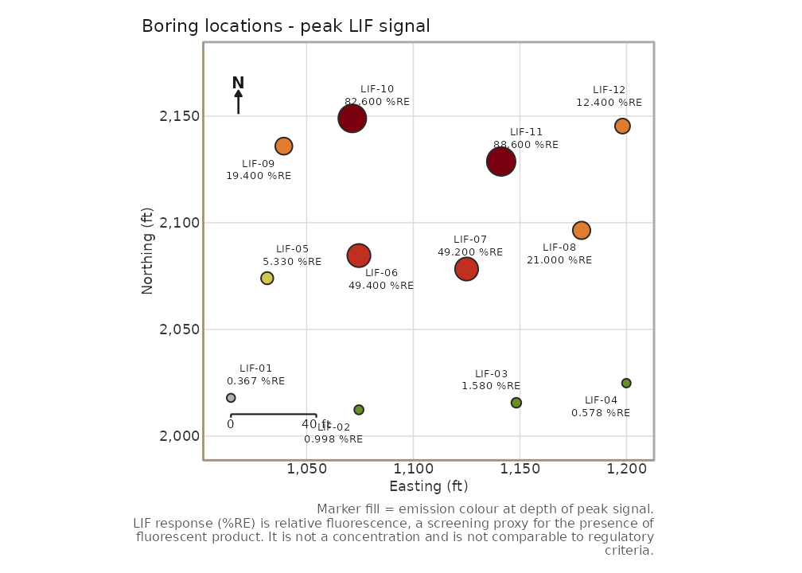
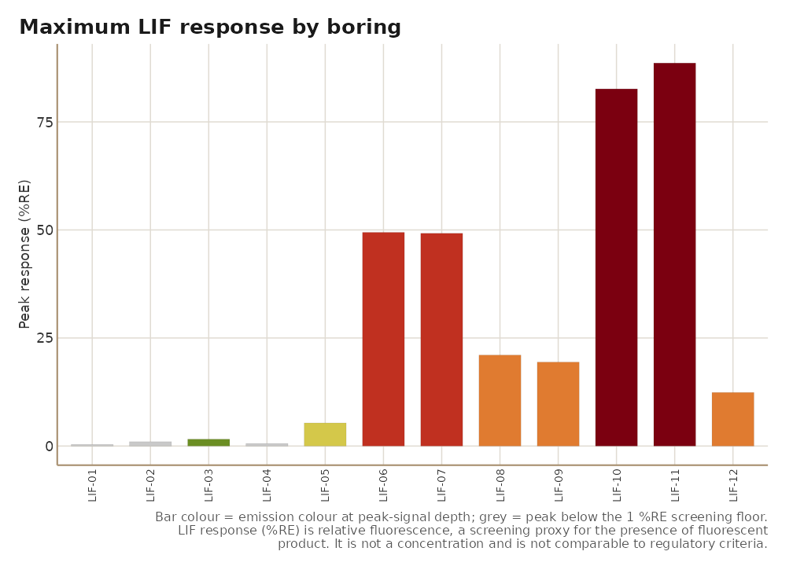

# Introduction to lifr: from raw LIF logs to a site report

Laser-Induced Fluorescence (LIF) probes such as UVOST and TarGOST are
pushed into the ground and record a fluorescence response every fraction
of a foot. Each boring produces one log file. This vignette walks
through a complete session with `lifr`: import the logs, look at the
data, mask a couple of artifacts with an audit trail, plot, and render
the site report.

It uses the synthetic demo site that ships with the package, so every
chunk runs on a fresh install.

``` r

library(lifr)
```

## 1. Import

A survey directory holds one `.lif.dat.txt` per boring plus a
`locations.csv` with each boring’s easting, northing, and ground-surface
elevation.
[`lif_import()`](https://mjorden.github.io/lifr/reference/lif_import.md)
reads everything, joins the coordinates, and keeps every column the
instrument recorded.

``` r

demo <- system.file("extdata", "demo", package = "lifr")
lif <- lif_import(demo)
#> Importing 12 log file(s) from /home/runner/work/_temp/Library/lifr/extdata/demo
#>   reading LIF-01.lif.dat.txt
#>   reading LIF-02.lif.dat.txt
#>   reading LIF-03.lif.dat.txt
#>   reading LIF-04.lif.dat.txt
#>   reading LIF-05.lif.dat.txt
#>   reading LIF-06.lif.dat.txt
#>   reading LIF-07.lif.dat.txt
#>   reading LIF-08.lif.dat.txt
#>   reading LIF-09.lif.dat.txt
#>   reading LIF-10.lif.dat.txt
#>   reading LIF-11.lif.dat.txt
#>   reading LIF-12.lif.dat.txt
#> Locations file: locations.csv
#> Imported 1489 row(s) across 12 boring(s).
lif
#> <lif_data> 12 boring(s), 1489 sample(s), depth 0.2-37.5 ft, 0 edit(s)
#>   channels: signal, ec, hp, color
#>    easting northing depth signal boring   msl    ec   hp   color
#> 1   1014.5   2017.9  0.25  2.506 LIF-01 149.6  8.87 2.79 #6B8E23
#> 2   1014.5   2017.9  0.50  0.206 LIF-01 149.6  9.31 2.41 #B0B0B0
#> 3   1014.5   2017.9  0.75  2.146 LIF-01 149.6  9.75 2.59 #6B8E23
#> 4   1014.5   2017.9  1.00  0.095 LIF-01 149.6  9.40 2.83 #B0B0B0
#> 5   1014.5   2017.9  1.25  0.208 LIF-01 149.6 10.38 2.97 #B0B0B0
#> 6   1014.5   2017.9  1.50  0.098 LIF-01 149.6  9.38 2.68 #B0B0B0
#> 7   1014.5   2017.9  1.75  0.213 LIF-01 149.6 10.07 2.72 #B0B0B0
#> 8   1014.5   2017.9  2.00  0.148 LIF-01 149.6  9.48 3.08 #B0B0B0
#> 9   1014.5   2017.9  2.25  0.050 LIF-01 149.6 10.04 2.86 #B0B0B0
#> 10  1014.5   2017.9  2.50  0.003 LIF-01 149.6  9.46 3.01 #B0B0B0
#> # ... 1479 more row(s)
```

The known channels are canonicalised to `depth`, `signal`, `ec`, `hp`,
and `color`; any other column in the source file is carried through
under a cleaned name.
[`lif_read()`](https://mjorden.github.io/lifr/reference/lif_read.md)
reads a single file the same way, without the locations join.

## 2. Summarise

``` r

qa <- summarize_lif(lif)
qa$overview
#>   n_borings n_samples   min     mean geom_mean geom_mean_n_excluded median
#> 1        12      1489 0.001 4.796974 0.5000454                    0  0.265
#>      max pct_detect
#> 1 88.607        100
head(qa$by_boring)
#>   boring   n   peak peak_depth      mean geom_mean geom_mean_n_excluded    p50
#> 1 LIF-11 116 88.607      16.75 17.428155 2.1299962                    0 2.5760
#> 2 LIF-10 110 82.625      16.75 11.949918 2.0692561                    0 2.2865
#> 3 LIF-06 150 49.434      18.25  7.987127 0.9368046                    0 0.3905
#> 4 LIF-07 116 49.217      16.00 10.106966 1.6164595                    0 1.8255
#> 5 LIF-08 109 21.045      17.00  4.157615 0.8652894                    0 0.8120
#> 6 LIF-09 125 19.417      15.25  3.646552 0.7762908                    0 0.5120
#>        p95
#> 1 74.57925
#> 2 45.34470
#> 3 34.20915
#> 4 39.87375
#> 5 17.72540
#> 6 14.93840
qa$by_threshold
#>   threshold units n_samples_above pct_samples_above n_borings_above
#> 1         1   %RE             475         31.900604              12
#> 2         2   %RE             396         26.595030              12
#> 3         5   %RE             288         19.341840               8
#> 4        10   %RE             204         13.700470               7
#> 5        50   %RE              20          1.343183               2
#>   pct_borings_above
#> 1         100.00000
#> 2         100.00000
#> 3          66.66667
#> 4          58.33333
#> 5          16.66667
```

`%RE` is relative fluorescence, a screening proxy for the presence of
fluorescent product. It is not a concentration, and `lifr` never
compares it to regulatory criteria.

## 3. Edit with an audit trail

Surface smear and known artifacts are masked with the editor family.
Every call appends a row to the frame’s edit history.

``` r

lif <- lif_zero_shallow(lif, depth = 1)
#> [lif_zero_shallow] zeroed 48 row(s) above 1 ft across 12 boring(s)
lif <- lif_editor(lif, "LIF-03", top = 20, bottom = 22)
#> [lif_editor] LIF-03: zeroed 9 row(s) (20-22 ft)
lif <- lif_keep(lif, "LIF-02", top = 6, bottom = 28)
#> [lif_keep] LIF-02: zeroed 55 row(s) outside 6-28 ft
lif <- hp_correction(lif, water_table = 6)
tail(edit_history(lif), 4)
#>                    timestamp            fn boring top bottom value
#> 12 2026-09-04 20:21:28 +0000    lif_editor LIF-12   0      1     0
#> 13 2026-09-04 20:21:28 +0000    lif_editor LIF-03  20     22     0
#> 14 2026-09-04 20:21:28 +0000      lif_keep LIF-02   6     28     0
#> 15 2026-09-04 20:21:28 +0000 hp_correction   <NA>  NA     NA    NA
#>    n_rows_changed                                           notes
#> 12              4                                            <NA>
#> 13              9                                            <NA>
#> 14             55 kept 6-28 ft; zeroed rows outside these windows
#> 15           1489                   gradient=0.433; water_table=6
```

The same edits can live in a CSV and be applied with
[`lif_apply_edits()`](https://mjorden.github.io/lifr/reference/lif_apply_edits.md);
a `boring` of `"*"` applies a row to every boring.

[`qc_compare()`](https://mjorden.github.io/lifr/reference/qc_compare.md)
shows what changed:

``` r

raw <- lif_import(demo, verbose = FALSE)
plots <- qc_compare(raw, lif)
#> qc_compare: 12 boring(s) with changes plotted, 0 unchanged.
plots[["LIF-02"]]
```



## 4. Plot

``` r

lif_plot(lif, "LIF-11")
```



``` r

lif_plot_all(lif, ncol = 4)
```



``` r

lif_overview(lif, "LIF-11")
```



``` r

boring_map(lif, use_instrument_color = TRUE)
```



``` r

depth_slice_map(lif, depth_range = c(12, 20))
```


``` r

chart_max_response(lif)
```



With a projected CRS and network access,
[`fetch_basemap()`](https://mjorden.github.io/lifr/reference/fetch_basemap.md)
pulls a public domain USGS imagery tile to draw under
[`boring_map()`](https://mjorden.github.io/lifr/reference/boring_map.md).

## 5. Report

[`process_site()`](https://mjorden.github.io/lifr/reference/process_site.md)
runs the whole pipeline in one call and writes a self-contained HTML
report (Summary, Data & QA, Processing history, and Boring logs tabs), a
Markdown report, and, when pandoc and LaTeX are available, a PDF plus a
one-page-per-boring logs PDF.

``` r

out <- tempfile("site")
site <- process_site(demo, output_dir = out, site_name = "Demo Site",
                     corrections = list(zero_shallow = 1, hp = list(water_table = 6)),
                     report_formats = c("html", "md"), quiet = TRUE)
site
#> <lif_site> Demo Site
#>   12 boring(s), 1489 sample(s), 13 edit(s), 4 chart(s)
#>   report(s): /tmp/RtmpgR5S2g/site20e11dd7c944/demo_site_report.html, /tmp/RtmpgR5S2g/site20e11dd7c944/demo_site_report.md
basename(unlist(site$reports))
#> [1] "demo_site_report.html" "demo_site_report.md"
```

## 6. Try it on your own data

``` r

lif <- lif_import("C:/Projects/MySite/LIF")
lif <- lif_apply_edits(lif, "C:/Projects/MySite/edits.csv")
site <- process_site("C:/Projects/MySite/LIF",
                     edits = "C:/Projects/MySite/edits.csv",
                     output_dir = "C:/Projects/MySite/out",
                     crs = 3452)      # your State Plane EPSG code
```

No field data yet?
[`lif_simulate()`](https://mjorden.github.io/lifr/reference/lif_simulate.md)
writes a plausible synthetic site.
