# Plot gallery

``` r

library(lifr)
library(ggplot2)
demo <- system.file("extdata", "demo", package = "lifr")
lif <- lif_import(demo, verbose = FALSE)
lif <- lif_zero_shallow(lif, depth = 1)
```

Every plotting function returns a ggplot (or a patchwork of them), so
you can add layers, change labels, or save with
[`ggsave()`](https://ggplot2.tidyverse.org/reference/ggsave.html) as
usual. All of them share
[`theme_lifr()`](https://mjorden.github.io/lifr/reference/theme_lifr.md).

## Depth profiles

### One boring: `lif_plot()`

Depth runs down the page. When the log carries an emission colour, the
trace is filled with it and a colour strip sits left of zero; otherwise
a single fill is used.

``` r

lif_plot(lif, "LIF-11")
```


Fix the signal axis to compare borings on the same scale, or cap the
depth:

``` r

lif_plot(lif, "LIF-05", ymax = 100, xmax = 25)
```

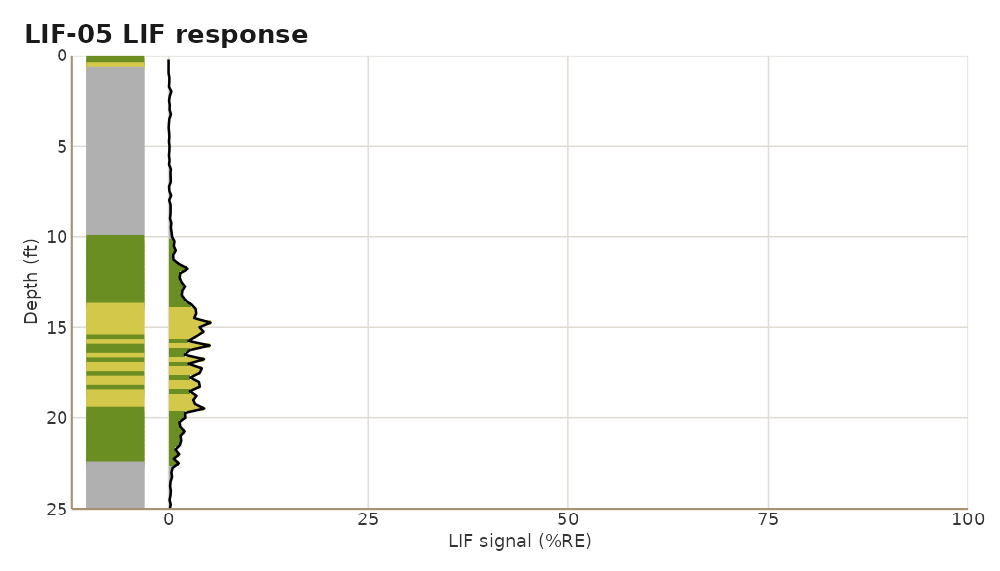

### Every boring: `lif_plot_all()`

``` r

lif_plot_all(lif, ncol = 4)
```

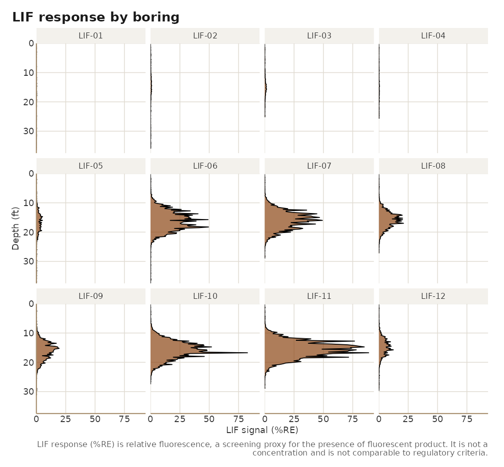

`layout = "list"` returns one full
[`lif_plot()`](https://mjorden.github.io/lifr/reference/lif_plot.md) per
boring instead, and `output_file` writes the facet figure straight to a
PNG.

### Multi-channel: `lif_overview()`

LIF beside conductivity and pressure on a shared depth axis. Channels
the boring did not record are skipped.

``` r

lif_overview(lif, "LIF-06")
```

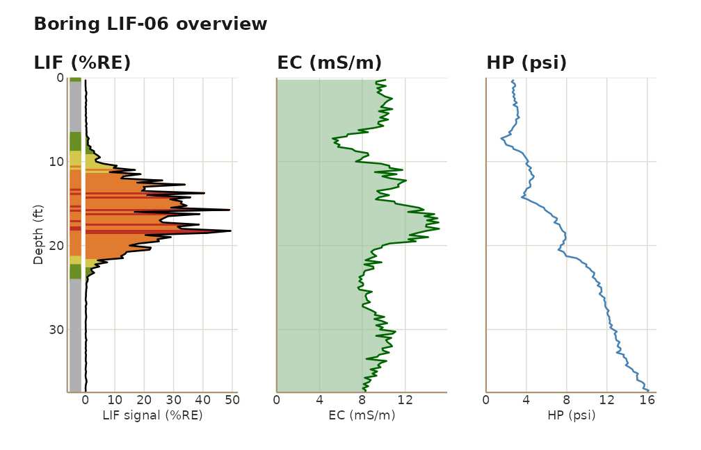

### Input versus edited: `qc_compare()`

``` r

edited <- lif_keep(lif, "LIF-10", top = 8, bottom = 24)
qc_compare(lif, edited)[["LIF-10"]]
```

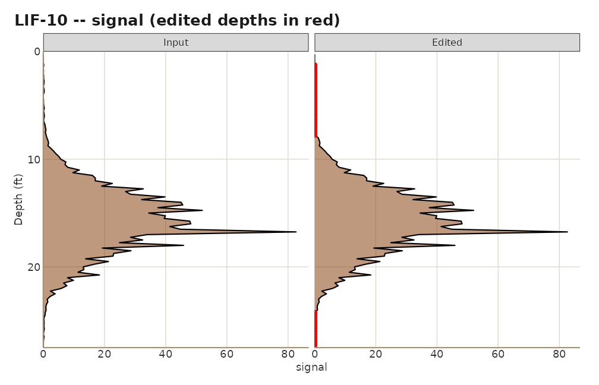

## Plan-view maps

### `boring_map()`

Each boring is a marker sized by the square root of its peak signal, so
the site’s pattern reads even in greyscale, and labelled with its name
and peak. Non-detects are hollow circles. A north arrow and scale bar
sit in whichever corners overlap the fewest borings.

``` r

boring_map(lif, site_name = "Demo site", figure_date = "2026-09-04",
           preparer = "Field team")
```

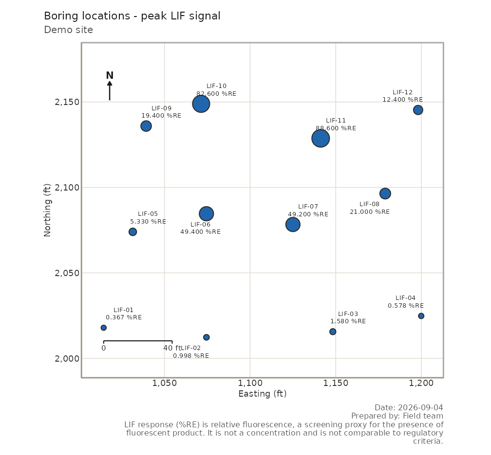

`use_instrument_color = TRUE` fills each marker with the emission colour
at the depth of peak signal, the product signature analysts read
directly:

``` r

boring_map(lif, use_instrument_color = TRUE)
```

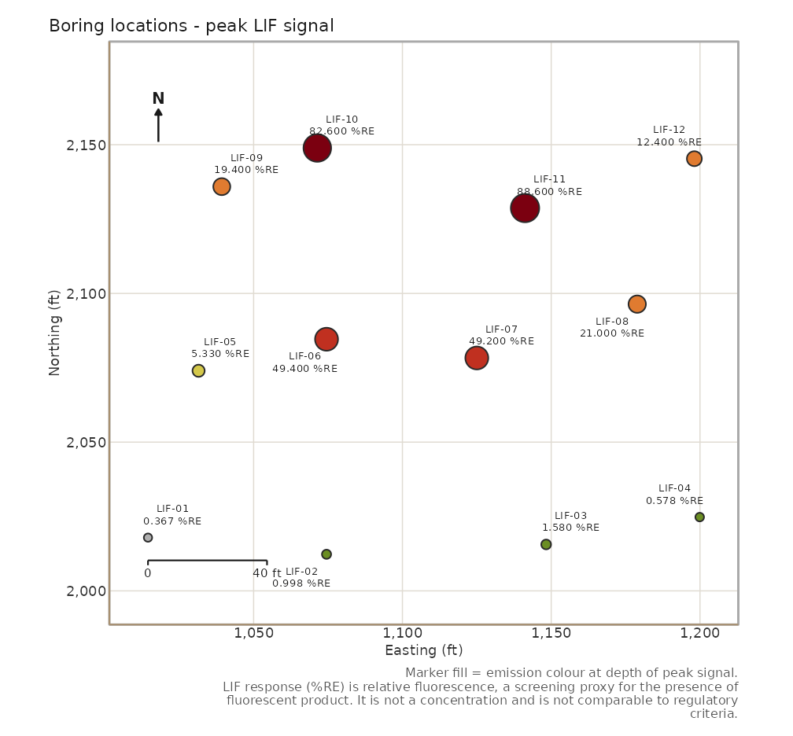

Restrict the peak to a depth window:

``` r

boring_map(lif, depth_min = 12, depth_max = 20, use_instrument_color = TRUE)
```

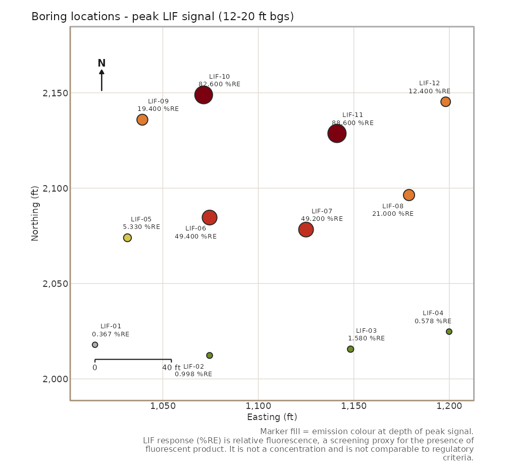

Other useful arguments: `nd_threshold` (peaks at or below it are
non-detects), `size_by_signal = FALSE` for uniform markers,
`coord_units` for metric sites, `crs_label` for the caption,
`repel = FALSE` to skip ggrepel, and `output_file` to save.

### Aerial imagery under the map

With a projected CRS and network access,
[`fetch_basemap()`](https://mjorden.github.io/lifr/reference/fetch_basemap.md)
pulls a public-domain USGS National Map tile for the site (US coverage
only) and
[`boring_map()`](https://mjorden.github.io/lifr/reference/boring_map.md)
draws it under the markers; labels switch to white with a dark halo.

``` r

bm <- fetch_basemap(lif, crs = 3452)   # NAD83 / Louisiana South (ftUS)
boring_map(lif, basemap = bm)
```

[`fetch_basemap()`](https://mjorden.github.io/lifr/reference/fetch_basemap.md)
needs the `sf` and `png` packages and returns `NULL` with a warning when
it cannot fetch, so a map call with `basemap = NULL` simply draws
without imagery.

### `depth_slice_map()`

Colour each boring by the aggregate (default maximum) of a channel
inside a depth band. Borings with no readings in the band are grey
crosses, so “not sampled here” is never mistaken for “no boring here”.

``` r

depth_slice_map(lif, depth_range = c(12, 20))
```

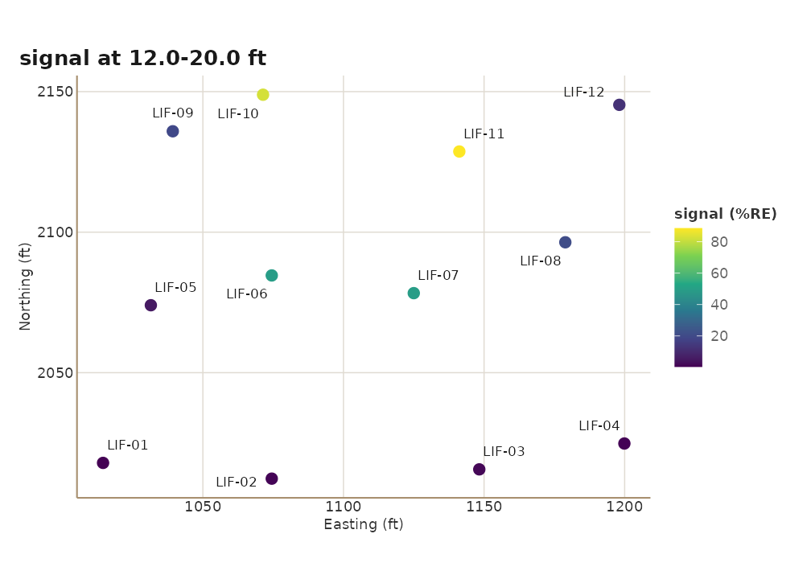

``` r

depth_slice_map(lif, depth_range = c(5, 10), channel = "ec", agg_fn = median)
```

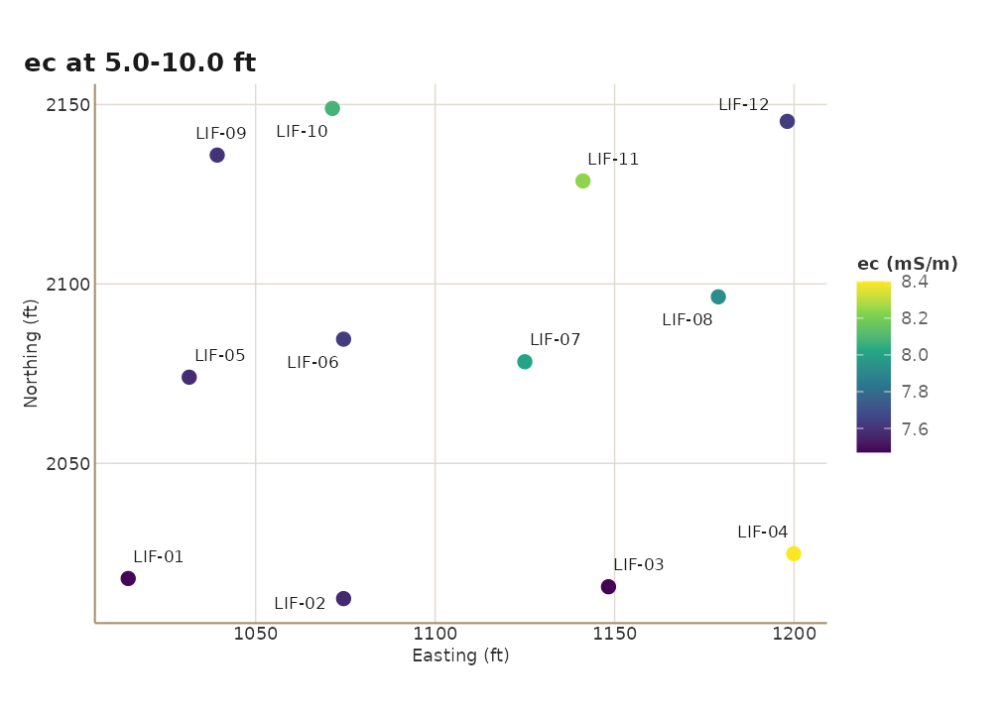

## Site charts

These are the figures the site report embeds; each is also available on
its own.

``` r

chart_max_response(lif, thresholds = c(1, 10, 50))
```

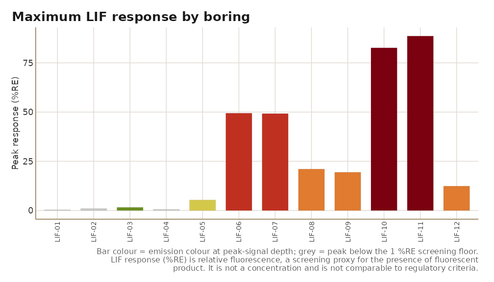

``` r

chart_peak_by_boring(lif)
```

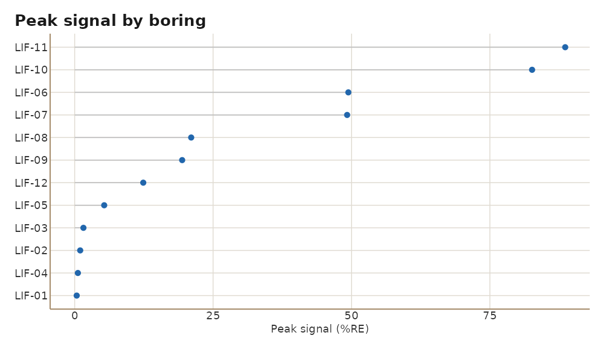

``` r

chart_hp_histogram(lif)
```

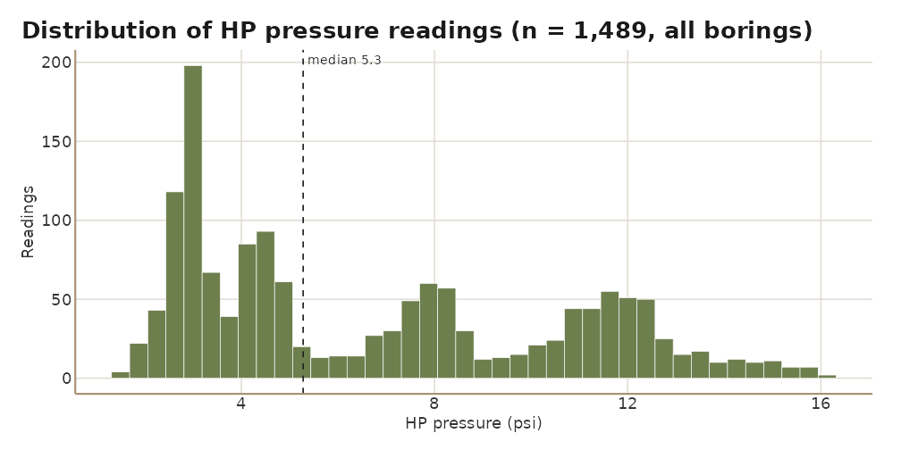

``` r

chart_ec_histogram(lif)
```

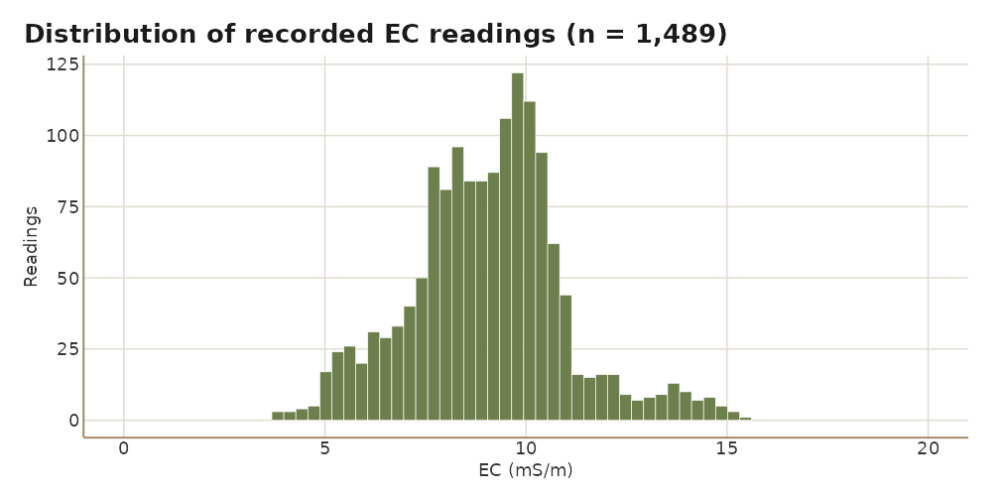

[`export_site_charts()`](https://mjorden.github.io/lifr/reference/export_site_charts.md)
writes whichever of them the data supports as PNGs in one call.

## Customising

Everything is a ggplot. Add layers or override labels:

``` r

lif_plot(lif, "LIF-11") +
  geom_hline(yintercept = 10, linetype = "dashed", colour = "grey40") +
  labs(title = "LIF-11 with a 10 %RE screening line",
       subtitle = "Demo site, September 2026")
```

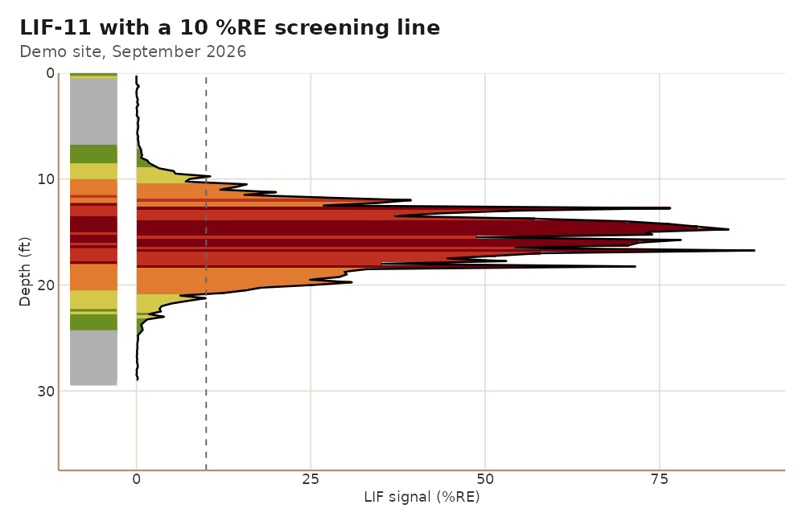

Use the package theme on your own figures:

``` r

re <- re_feet(lif)
ggplot(re, aes(x = reorder(boring, re_feet), y = re_feet)) +
  geom_col(fill = "#6E7F4E") +
  coord_flip() +
  labs(x = NULL, y = "RE-feet (integrated signal)",
       title = "Integrated LIF response by boring") +
  theme_lifr()
```

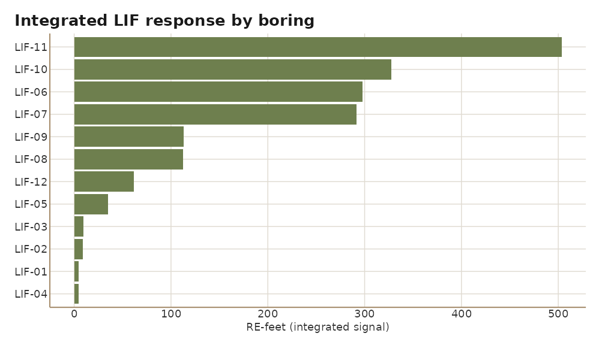

Save any plot with
[`ggplot2::ggsave()`](https://ggplot2.tidyverse.org/reference/ggsave.html):

``` r

ggsave("boring_map.png", boring_map(lif), width = 8, height = 7, dpi = 200)
```
