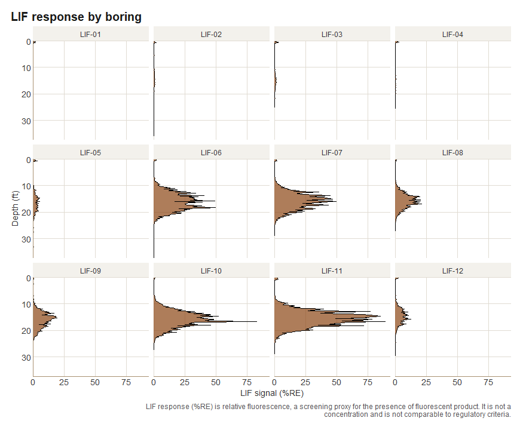
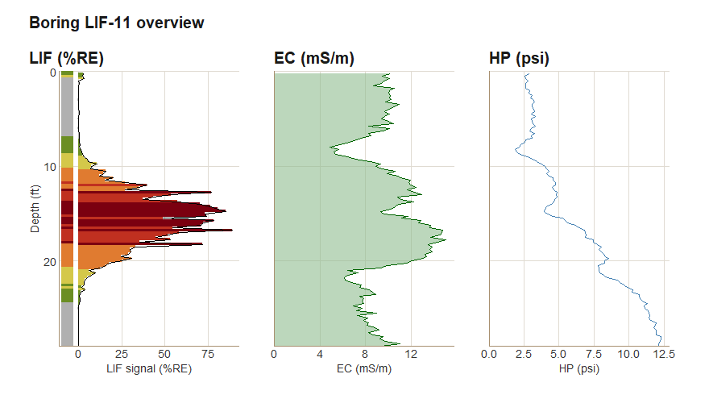
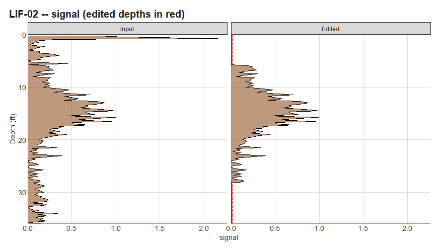
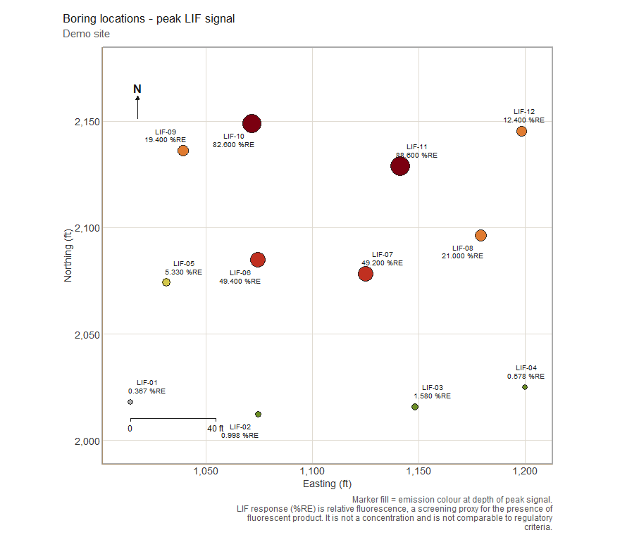
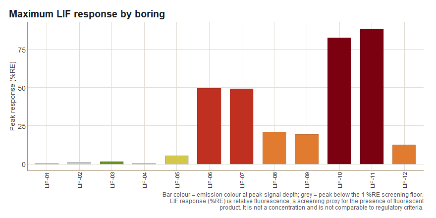

# lifr

**lifr** reads Laser-Induced Fluorescence (LIF) borehole logs from
high-resolution site characterization surveys (UVOST, TarGOST, and
similar direct-push fluorescence probes), lets you clean them with a
recorded audit trail, and turns them into plots and a site report.

| Stage | What lifr does |
|----|----|
| **Import** | Reads every `.lif.dat.txt` in a folder into one tidy data frame, keeping every channel the instrument recorded, and joins boring coordinates from a locations file. |
| **Edit** | Masks known-bad depth intervals. Every edit is logged in an audit trail that travels with the data and prints in the report. |
| **Summarise & plot** | QA statistics, depth profiles, multi-channel overviews, plan-view boring maps (optionally over USGS aerial imagery), depth-slice maps, and site summary charts. |
| **Report** | A self-contained HTML site report with Summary, Data & QA, Processing history, and Boring logs tabs, plus Markdown and PDF. |

Full documentation, with every function and worked articles, is at
<https://mjorden.github.io/lifr/>.

## Installation

``` r

# install.packages("remotes")
remotes::install_github("mjorden/lifr")
```

lifr needs R 4.1 or newer. Optional extras: `ggrepel` for
non-overlapping map labels, `sf` and `png` for aerial-imagery basemaps,
and `rmarkdown` plus a LaTeX distribution (for example
[`tinytex::install_tinytex()`](https://rdrr.io/pkg/tinytex/man/install_tinytex.html))
for the PDF report.

## Five-minute tour

The package ships with a synthetic 12-boring site so everything below
runs on a fresh install.

``` r

library(lifr)

demo <- system.file("extdata", "demo", package = "lifr")
lif <- lif_import(demo, verbose = FALSE)
lif
#> <lif_data> 12 boring(s), 1489 sample(s), depth 0.2-37.5 ft, 0 edit(s)
#>   channels: signal, ec, hp, color
#>    easting northing depth signal boring   msl    ec   hp   color
#> 1   1014.5   2017.9  0.25  2.506 LIF-01 149.6  8.87 2.79 #6B8E23
#> 2   1014.5   2017.9  0.50  0.206 LIF-01 149.6  9.31 2.41 #B0B0B0
#> 3   1014.5   2017.9  0.75  2.146 LIF-01 149.6  9.75 2.59 #6B8E23
#> 4   1014.5   2017.9  1.00  0.095 LIF-01 149.6  9.40 2.83 #B0B0B0
#> 5   1014.5   2017.9  1.25  0.208 LIF-01 149.6 10.38 2.97 #B0B0B0
#> 6   1014.5   2017.9  1.50  0.098 LIF-01 149.6  9.38 2.68 #B0B0B0
#> 7   1014.5   2017.9  1.75  0.213 LIF-01 149.6 10.07 2.72 #B0B0B0
#> 8   1014.5   2017.9  2.00  0.148 LIF-01 149.6  9.48 3.08 #B0B0B0
#> 9   1014.5   2017.9  2.25  0.050 LIF-01 149.6 10.04 2.86 #B0B0B0
#> 10  1014.5   2017.9  2.50  0.003 LIF-01 149.6  9.46 3.01 #B0B0B0
#> # ... 1479 more row(s)
```

One row per depth reading. The known channels are canonicalised to
`signal` (%RE), `ec` (mS/m), `hp` (psi), and `color`
(emission-wavelength hex); any other column in the source files is
carried through untouched.

### Look at the logs

``` r

lif_plot_all(lif, ncol = 4)
```



``` r

lif_overview(lif, "LIF-11")
```



### Clean up with an audit trail

Surface smear in the top foot and a rod-change artifact in one boring
are typical things to mask before summarising. Each call appends a row
to the edit history.

``` r

lif <- lif_zero_shallow(lif, depth = 1)
lif <- lif_editor(lif, "LIF-03", top = 20, bottom = 22)
lif <- lif_keep(lif, "LIF-02", top = 6, bottom = 28)   # keep one clean window
tail(edit_history(lif), 3)
#>                    timestamp         fn boring top bottom value n_rows_changed
#> 12 2026-09-04 14:40:07 -0600 lif_editor LIF-12   0      1     0              4
#> 13 2026-09-04 14:40:07 -0600 lif_editor LIF-03  20     22     0              9
#> 14 2026-09-04 14:40:07 -0600   lif_keep LIF-02   6     28     0             55
#>                                              notes
#> 12                                            <NA>
#> 13                                            <NA>
#> 14 kept 6-28 ft; zeroed rows outside these windows
```

[`qc_compare()`](https://mjorden.github.io/lifr/reference/qc_compare.md)
shows exactly what changed, with the edited depths in red:

``` r

plots <- qc_compare(lif_import(demo, verbose = FALSE), lif)
plots[["LIF-02"]]
```



### Summarise

``` r

qa <- summarize_lif(lif)
qa$overview
#>   n_borings n_samples min    mean geom_mean geom_mean_n_excluded median    max
#> 1        12      1489   0 4.75113  0.529891                  108  0.242 88.607
#>   pct_detect
#> 1   92.74681
head(qa$by_boring)
#>   boring   n   peak peak_depth      mean geom_mean geom_mean_n_excluded    p50
#> 1 LIF-11 116 88.607      16.75 17.357026 2.2040584                    4 1.8250
#> 2 LIF-10 110 82.625      16.75 11.922682 2.1773476                    4 2.2865
#> 3 LIF-06 150 49.434      18.25  7.949300 0.9372923                    4 0.3355
#> 4 LIF-07 116 49.217      16.00 10.066043 1.6600752                    4 1.7645
#> 5 LIF-08 109 21.045      17.00  4.133661 0.8925489                    4 0.5590
#> 6 LIF-09 125 19.417      15.25  3.628224 0.7943718                    4 0.4600
#>        p95
#> 1 74.57925
#> 2 45.34470
#> 3 34.20915
#> 4 39.87375
#> 5 17.72540
#> 6 14.93840
```

### Map the site

``` r

boring_map(lif, use_instrument_color = TRUE, site_name = "Demo site")
```



``` r

chart_max_response(lif)
```



### Render the report

``` r

site <- process_site(demo, output_dir = "out", site_name = "Demo site",
                     corrections = list(zero_shallow = 1))
site$reports$html
```

The HTML report is one self-contained file: stat tiles, the boring maps,
peak-response tables, QA statistics, the complete edit log, and a
one-boring-per-section log browser showing input beside edited data with
the zeroed windows shaded.

## Learn more

- [`vignette("intro")`](https://mjorden.github.io/lifr/articles/intro.md):
  getting started, end to end.
- [`vignette("data-format")`](https://mjorden.github.io/lifr/articles/data-format.md):
  the raw file formats and what import does with them.
- [`vignette("editing")`](https://mjorden.github.io/lifr/articles/editing.md):
  masking artifacts, edit plans, and the audit trail.
- [`vignette("plotting")`](https://mjorden.github.io/lifr/articles/plotting.md):
  a gallery of every plot with its options.
- [`vignette("reporting")`](https://mjorden.github.io/lifr/articles/reporting.md):
  [`process_site()`](https://mjorden.github.io/lifr/reference/process_site.md),
  the report tabs, and output files.

## About %RE

LIF response is relative fluorescence, expressed as a percentage of a
reference emitter (%RE). It indicates where fluorescent product is
likely present. It is not a concentration and is not comparable to
regulatory criteria; lifr never maps it onto such criteria.

## Synthetic data

The bundled demo site and every figure in the documentation come from
[`lif_simulate()`](https://mjorden.github.io/lifr/reference/lif_simulate.md).
They have no relation to any real site. Use
[`lif_simulate()`](https://mjorden.github.io/lifr/reference/lif_simulate.md)
to try the package before you have field data.

## License

MIT. See `LICENSE.md`.
